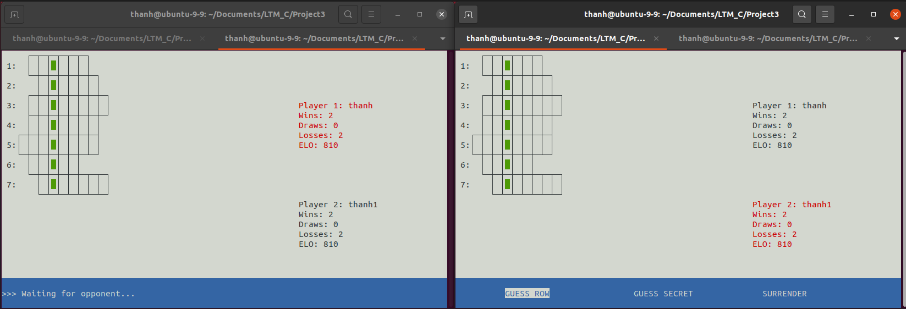

## How to run
Project only run on Ubuntu
1. **Clone repository**
```sh
git clone https://github.com/thanh-nt25/Crossword-Puzzle-Network-Programming.git
```
2. **Run makefile**
```sh
make all
```
3. **Run server and client program**
## Some images of project
### Online list

### On game


**Finish**

### Server log

